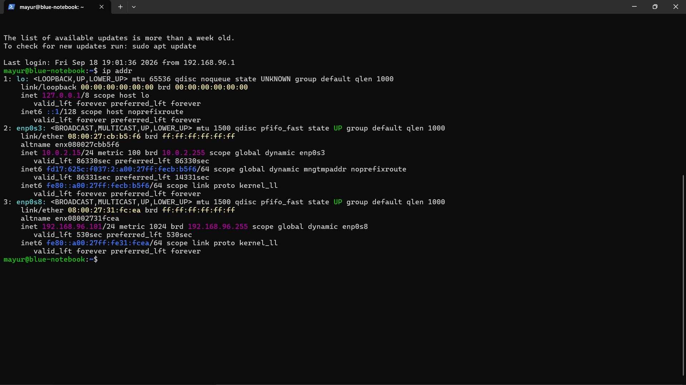
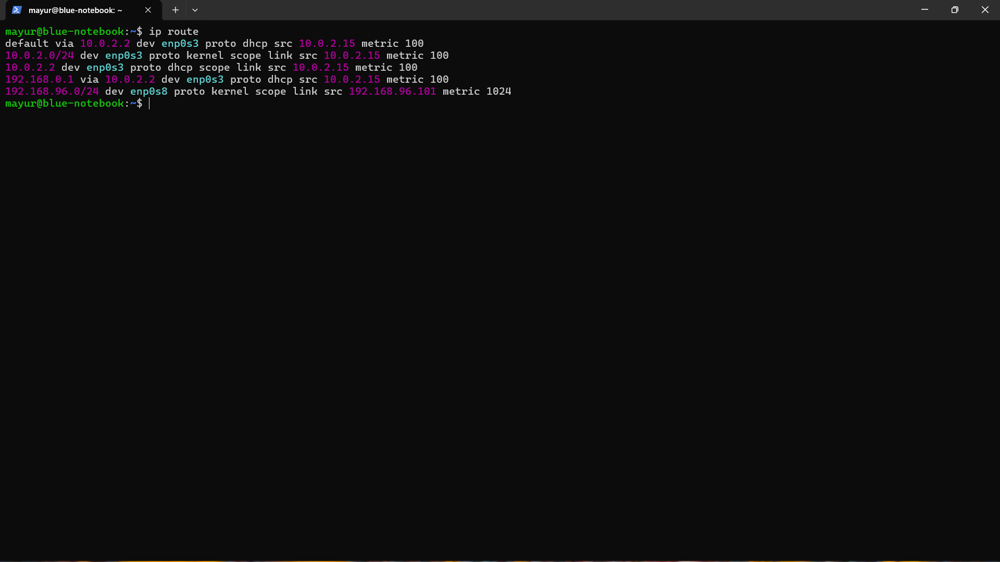
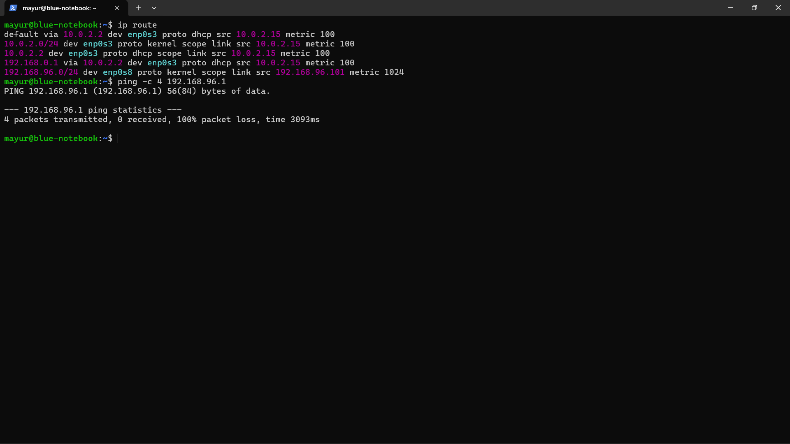
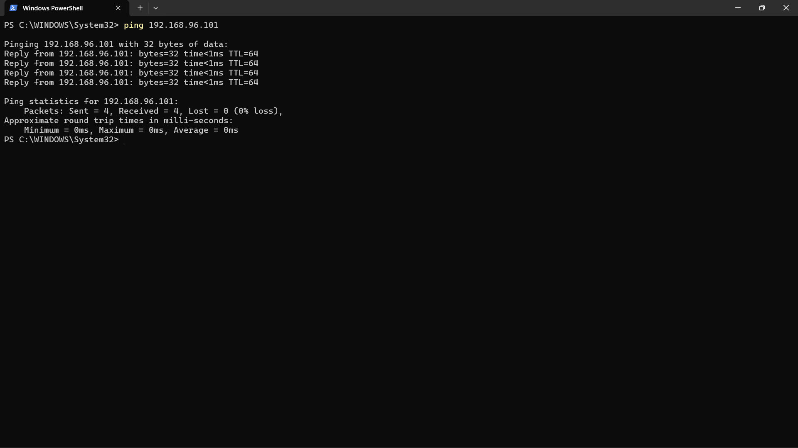
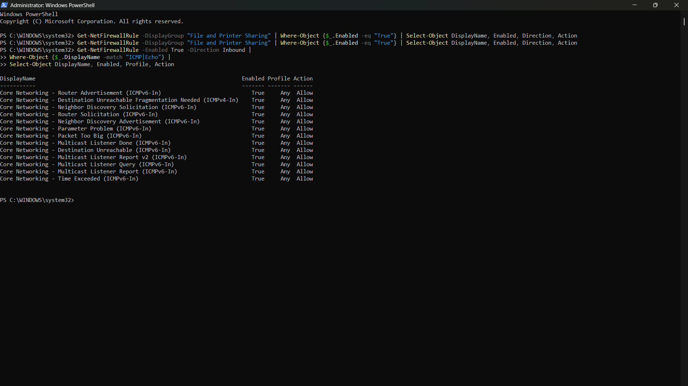
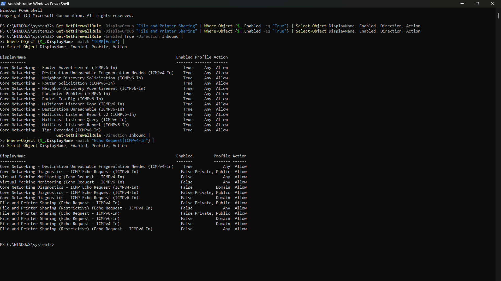
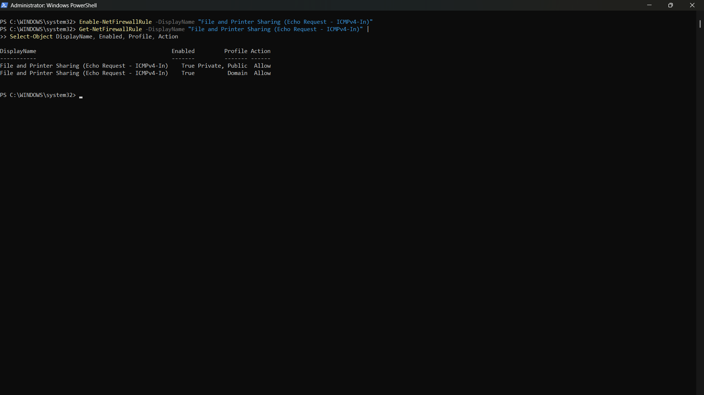
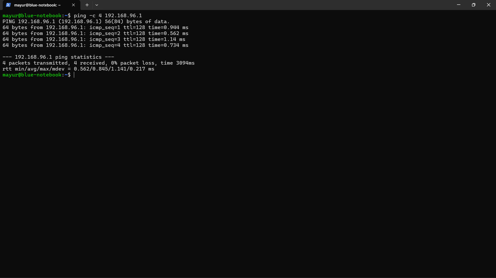

# Case 01 — Host-Only Network Connectivity Troubleshooting

## Objective
Troubleshoot and restore connectivity between the Windows host and Ubuntu VM over the VirtualBox Host-Only network.

## Scenario
Ubuntu could communicate with its own Host-Only interface, and Windows could reach Ubuntu, but Ubuntu could not initially reach the Windows Host-Only adapter.

## Investigation
1. Verified Ubuntu IP configuration.
2. Checked the routing table.
3. Tested connectivity from Ubuntu to the Windows Host-Only adapter.
4. Tested the reverse direction from Windows to Ubuntu.
5. Checked the Windows inbound ICMPv4 firewall rule.
6. Identified that the required **File and Printer Sharing (Echo Request - ICMPv4-In)** rule was disabled.

## Resolution
Enabled the Windows inbound ICMPv4 Echo Request rule.

## Verification
After the firewall rule was enabled, Ubuntu successfully pinged the Windows Host-Only adapter with 0% packet loss.

## Evidence

### 01 — IP Configuration

### 02 — Routing Table

### 03 — Initial Host-Only Ping Failure

### 04 — Windows-to-Ubuntu Ping Success

### 05 — Windows ICMP Firewall Check

### 06 — Disabled ICMPv4 Echo Rule

### 07 — ICMPv4 Rule Enabled

### 08 — Host-Only Ping Success After Fix

## Key Learning
A connectivity problem can be directional. Testing both directions and checking the relevant host firewall helped isolate the issue instead of assuming the VirtualBox network itself was broken.
