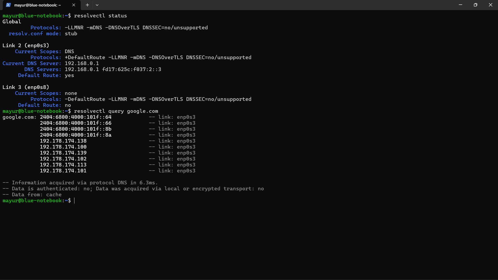
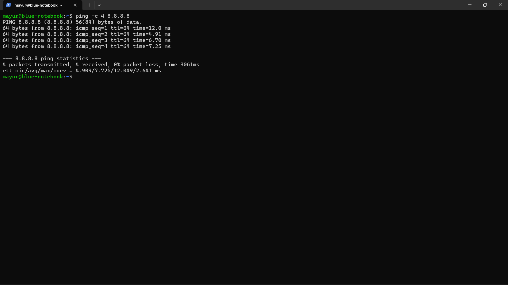
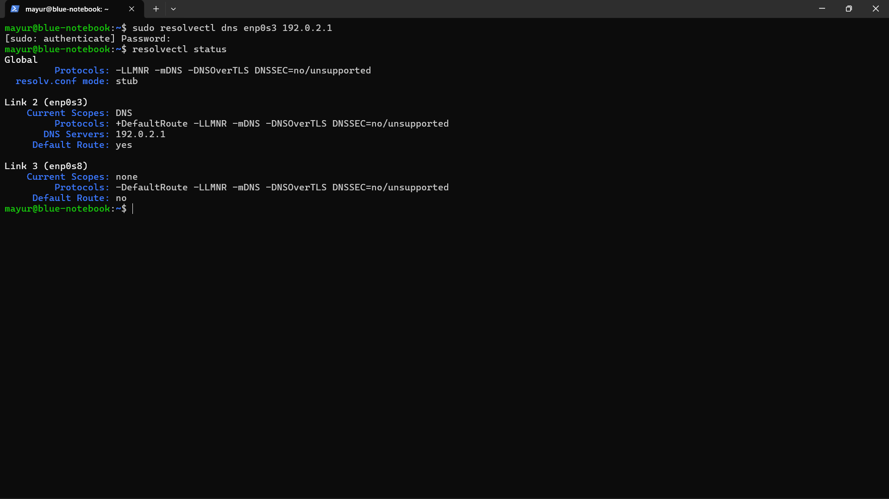
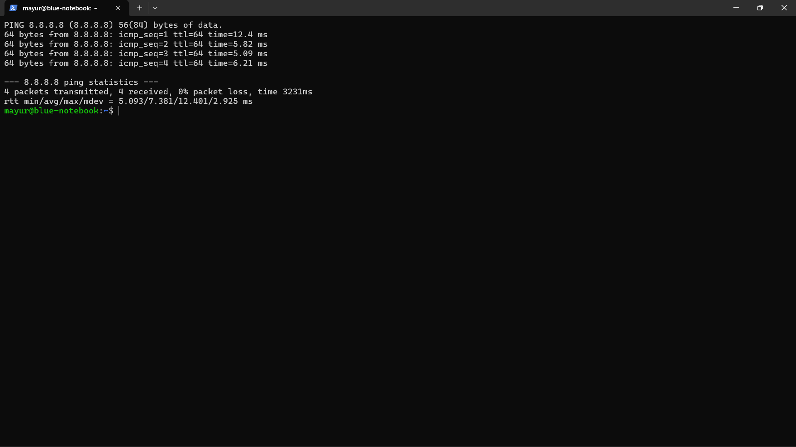
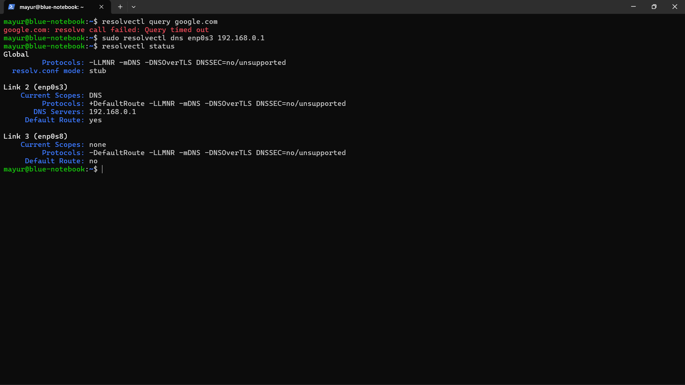
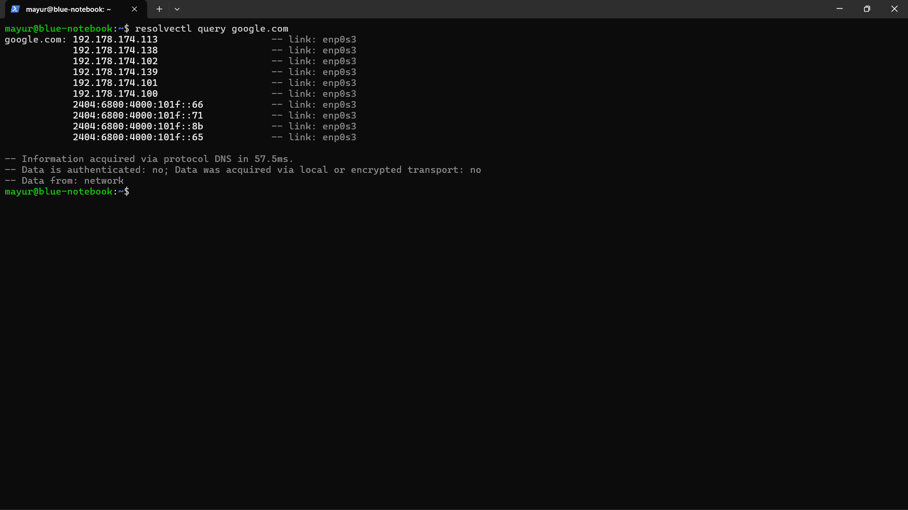

# Case 02 — DNS Troubleshooting

## Objective
Diagnose a controlled DNS failure and distinguish name-resolution problems from general network connectivity problems.

## Scenario
Internet connectivity by IP continued to work, while hostname resolution failed after a controlled DNS misconfiguration.

## Investigation
1. Established a DNS baseline.
2. Verified connectivity to the NAT gateway.
3. Verified connectivity to a public IP address.
4. Confirmed that hostname resolution initially worked.
5. Inspected DNS configuration with `resolvectl status`.
6. Introduced a controlled invalid DNS server configuration.
7. Tested hostname resolution and direct IP connectivity separately.
8. Queried DNS directly with `resolvectl query`.

## Resolution
Restored the working DNS server configuration on the Ubuntu NAT interface.

## Verification
Hostname resolution succeeded again after the DNS configuration was restored.

## Evidence

### 09 — DNS Baseline

### 10 — Internet IP Baseline

### 11 — DNS Misconfiguration

### 12 — DNS Failure — IP Still Works

### 13 — DNS Query Timeout

### 14 — DNS Restored

### 15 — DNS Fix Verified

## Key Learning
When an IP address works but a hostname does not, DNS should be investigated separately from basic network connectivity.
