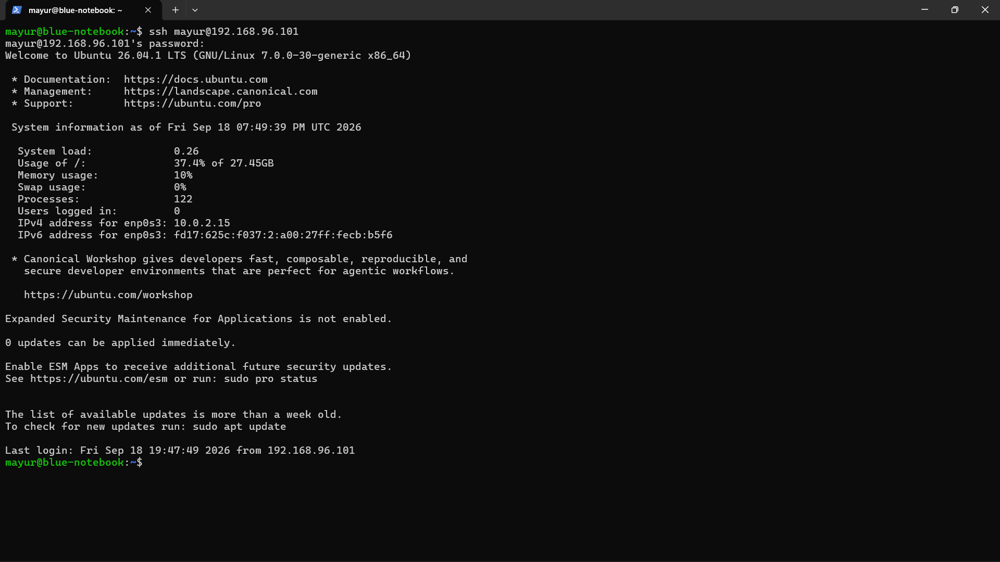
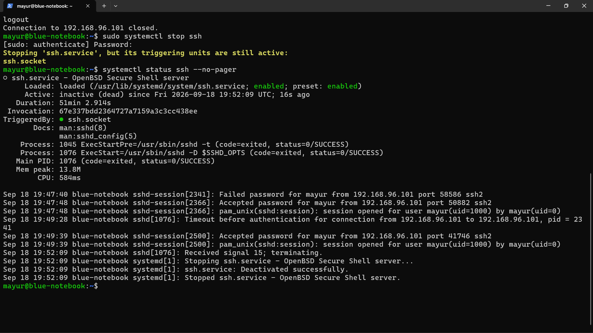
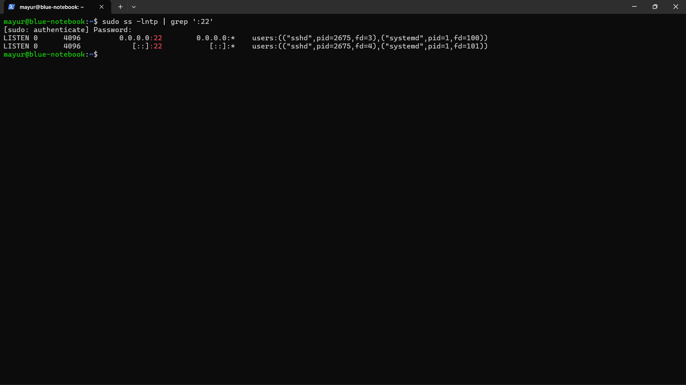
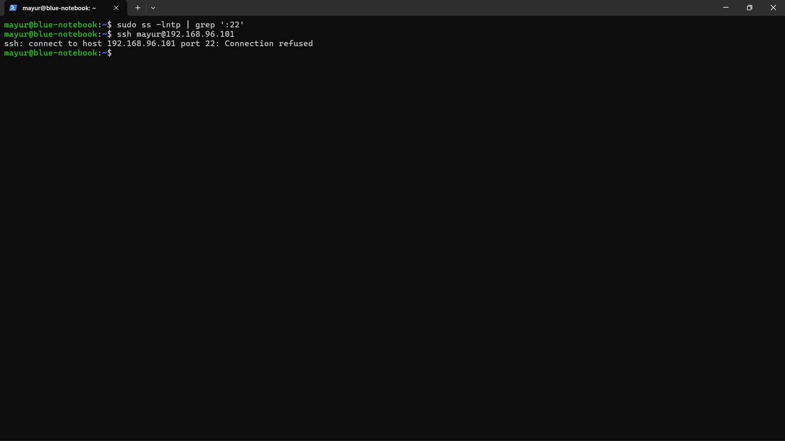
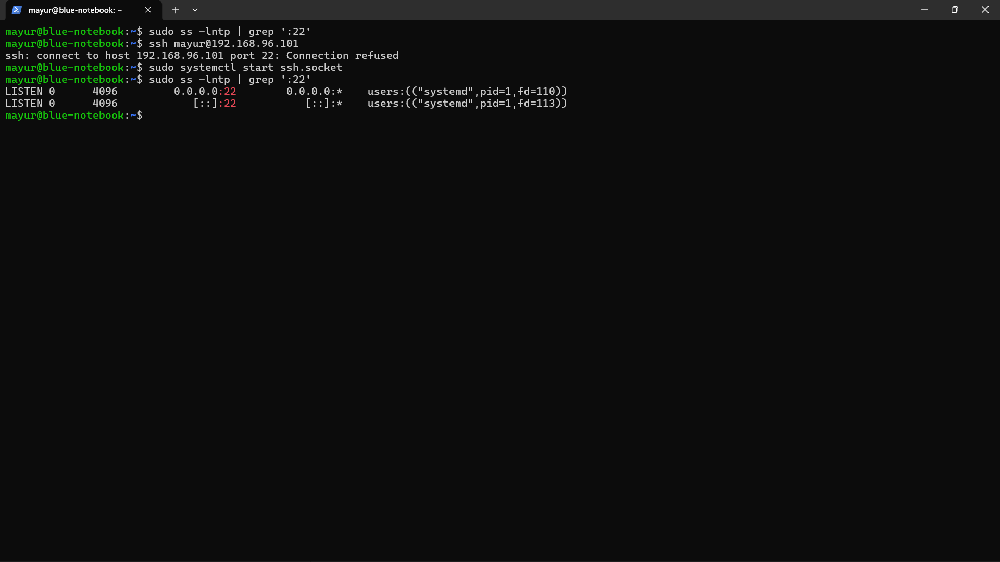
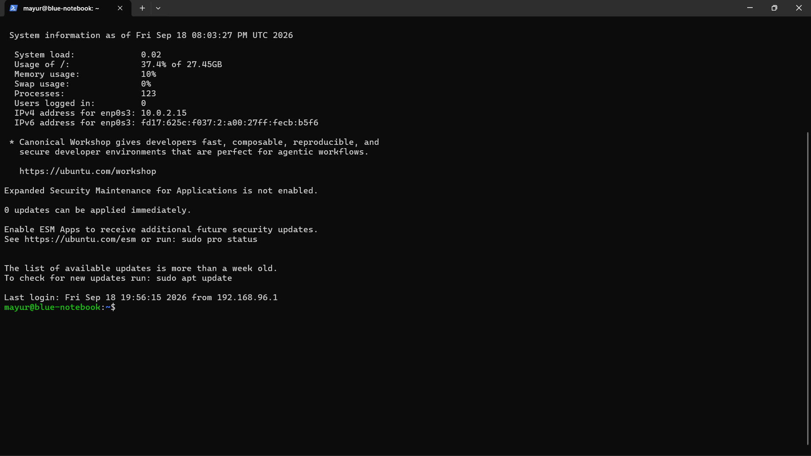

# Case 03 — SSH Service Troubleshooting

## Objective
Troubleshoot an SSH connectivity failure caused by the SSH service/socket state.

## Scenario
SSH connectivity from Windows to Ubuntu was working initially. The SSH service/socket was then stopped in a controlled lab test, causing connection attempts to fail.

## Investigation
1. Confirmed the SSH baseline.
2. Checked the SSH service state.
3. Checked TCP port 22 with `ss`.
4. Stopped the SSH service/socket.
5. Verified that port 22 was no longer available.
6. Tested SSH from Windows and observed connection refusal.
7. Restored the SSH socket/service.
8. Verified that TCP port 22 was listening again.

## Resolution
Restored the SSH socket/service so that the SSH daemon could accept connections.

## Verification
The SSH connection from Windows to Ubuntu succeeded after the service/socket was restored.

## Evidence

### 16 — SSH Baseline Success

### 17 — SSH Service Stopped

### 18 — SSH Port Listening

### 19 — SSH Port Not Listening

### 20 — SSH Connection Refused

### 21 — SSH Port Restored

### 22 — SSH Connection Restored

## Key Learning
A connection refusal can indicate that the destination service is not listening. Checking both service state and listening ports helps separate service problems from network problems.
