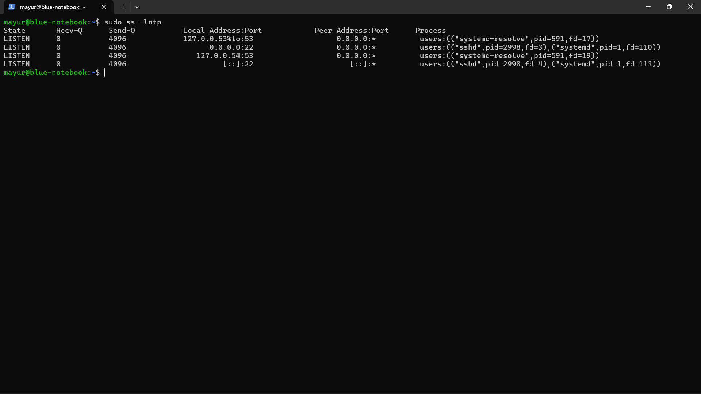
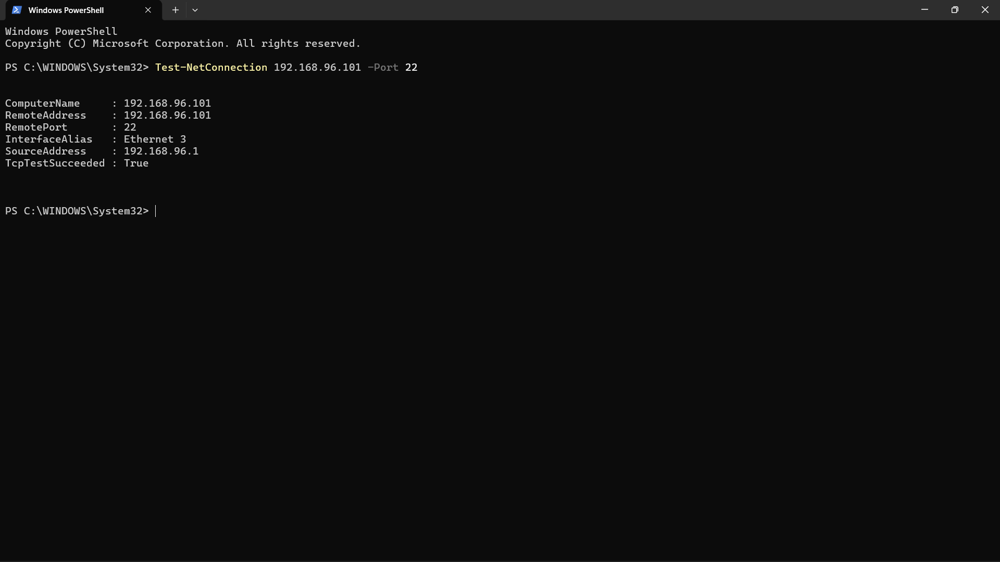
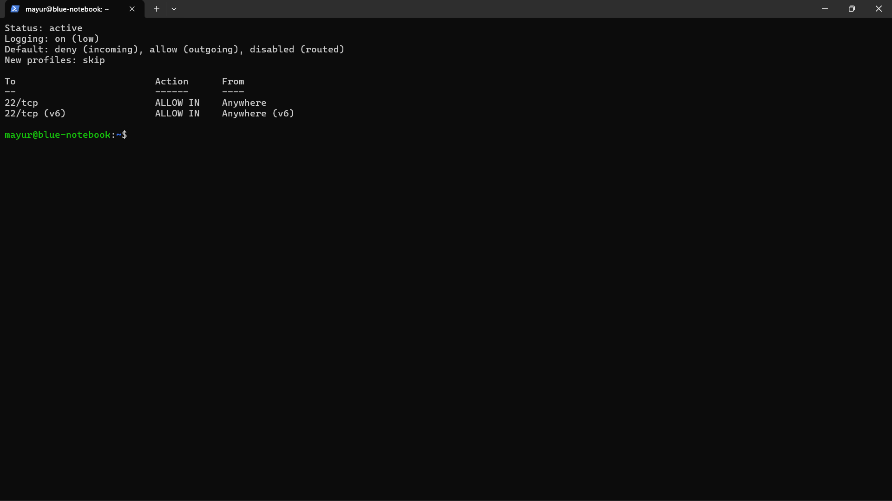
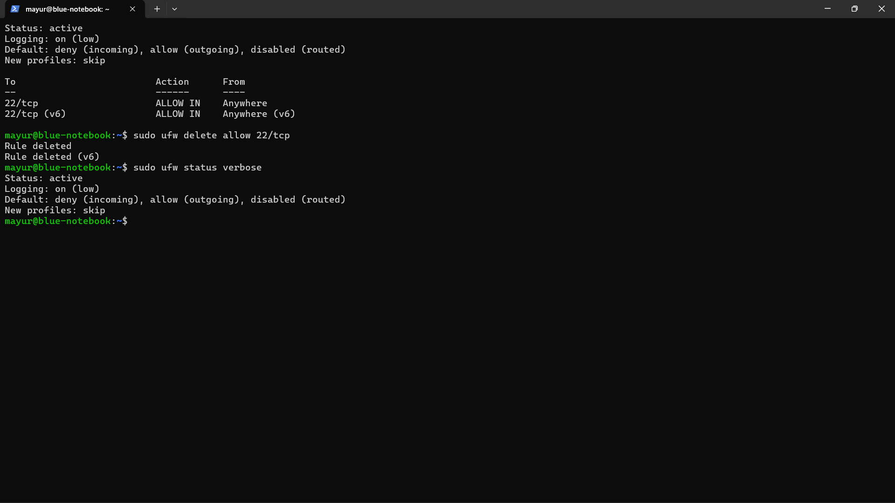
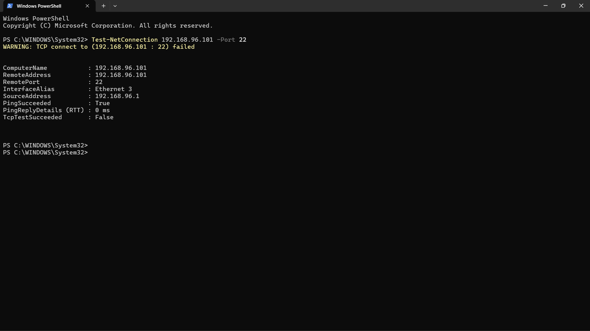
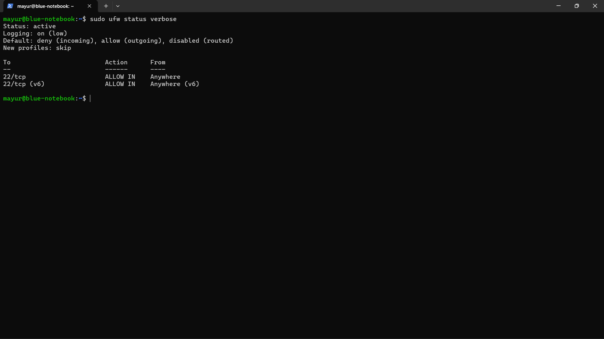

# Case 04 — UFW Firewall & TCP Port Troubleshooting

## Objective
Understand how a host firewall rule affects access to a TCP service.

## Scenario
SSH was available on TCP port 22. UFW was enabled and configured to allow SSH, then the allow rule was removed to create a controlled firewall block.

## Investigation
1. Checked the baseline listening ports.
2. Verified TCP port 22 connectivity from Windows.
3. Enabled UFW.
4. Added an SSH allow rule for TCP port 22.
5. Verified the UFW configuration.
6. Removed the SSH allow rule while the default incoming policy remained deny.
7. Tested TCP port 22 from Windows.
8. Confirmed that ping still worked while the TCP connection failed.
9. Restored the SSH allow rule.

## Resolution
Restored the UFW rule allowing TCP port 22.

## Verification
The SSH port was restored to the expected firewall configuration and later verified through the SSH service/port checks.

## Evidence

### 23 — Listening ports baseline

### 24 — TCP port 22 baseline

### 25 — UFW SSH allowed

### 26 — UFW SSH blocked

### 27 — TCP port 22 blocked

### 28 — UFW SSH restored

## Key Learning
ICMP reachability and TCP service reachability are different tests. A host can respond to ping while a firewall blocks a specific TCP service port.
