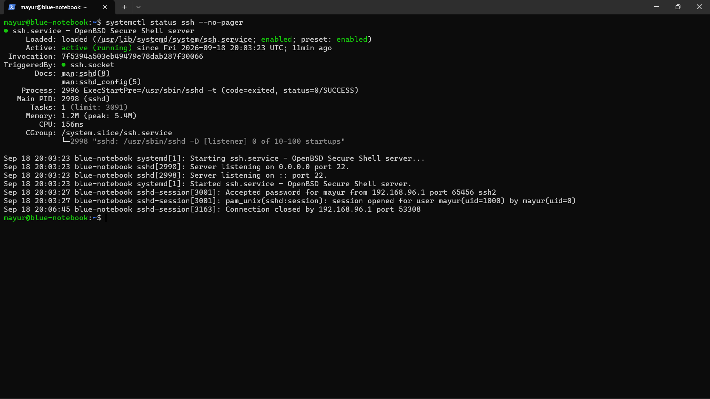
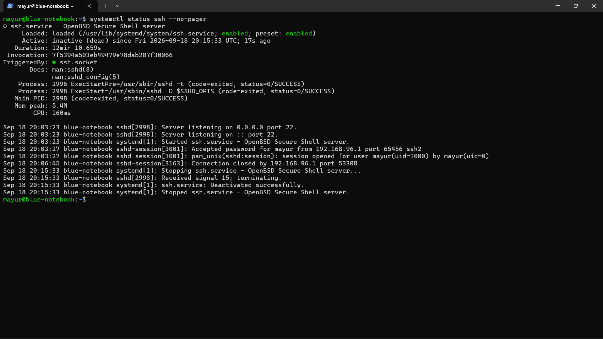
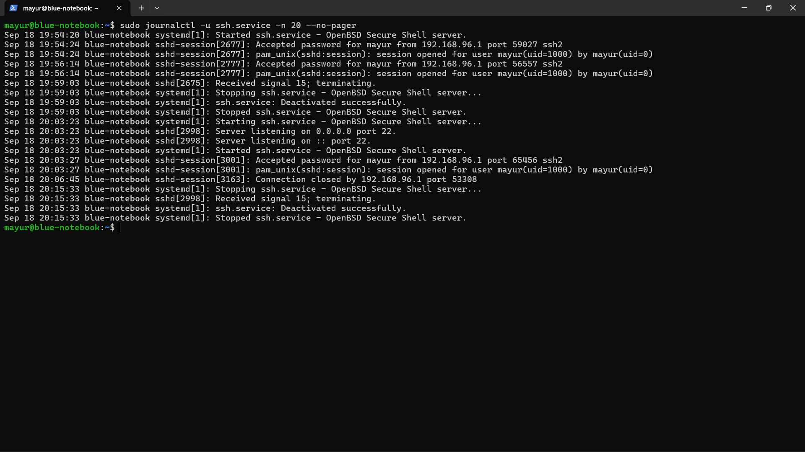
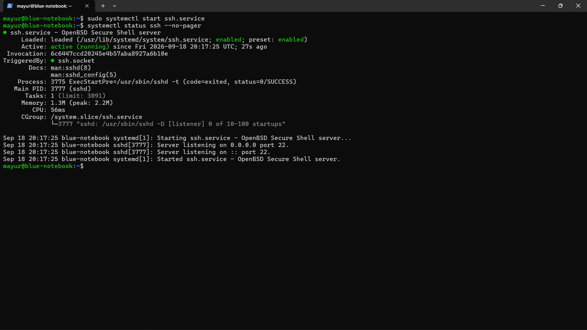
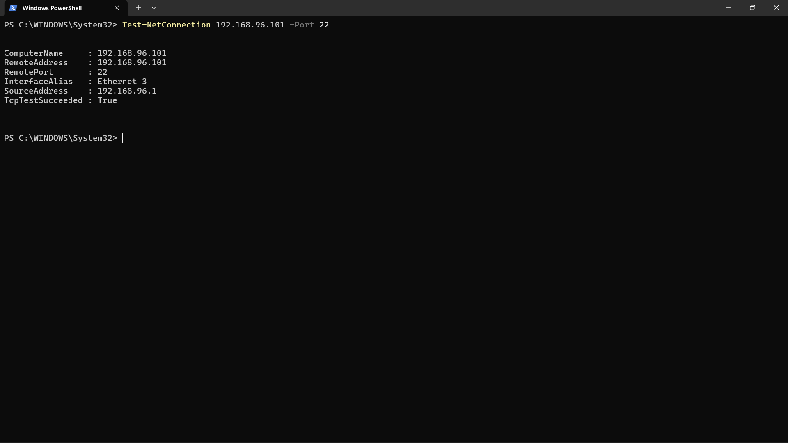

# Case 05 — SSH Service State & Log Investigation

## Objective
Use Linux service status, listening-port information, and journal logs to investigate an SSH service failure and verify recovery.

## Scenario
The SSH service was stopped in a controlled lab test. The service state and system journal were then examined before restoring the service.

## Investigation
1. Captured the SSH service baseline.
2. Stopped `ssh.service`.
3. Verified that the service became inactive/dead.
4. Reviewed recent SSH service journal entries.
5. Identified service termination and deactivation events.
6. Started the SSH service again.
7. Confirmed that the service returned to an active/running state.
8. Verified that TCP port 22 was listening.
9. Performed a final Windows-side TCP connectivity test.

## Resolution
Restarted the SSH service.

## Verification
The final Windows `Test-NetConnection` test confirmed TCP port 22 was reachable again.

## Evidence

### 29 — SSH service baseline

### 30 — SSH service failure

### 31 — SSH service logs

### 32 — SSH service restored

### 33 — SSH port final verification

## Key Learning
Service troubleshooting should combine service state, logs, listening-port checks, and an external connectivity test rather than relying on a single indicator.
